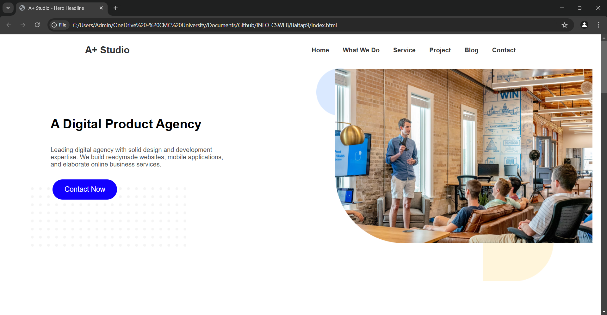
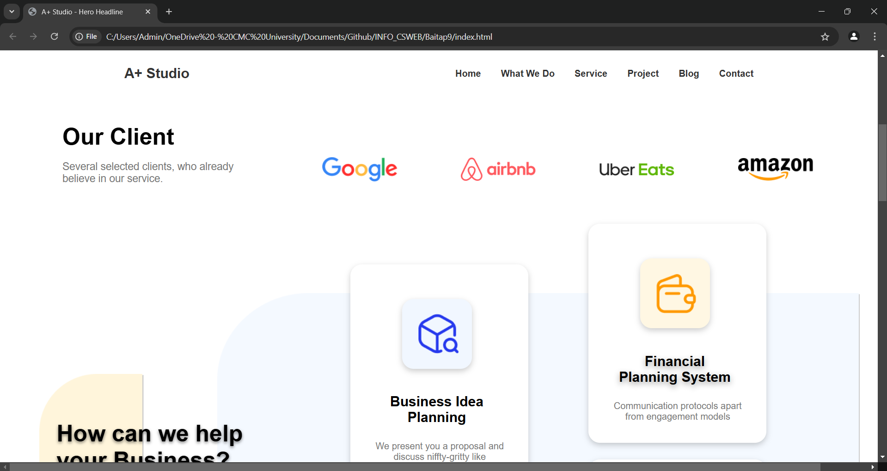
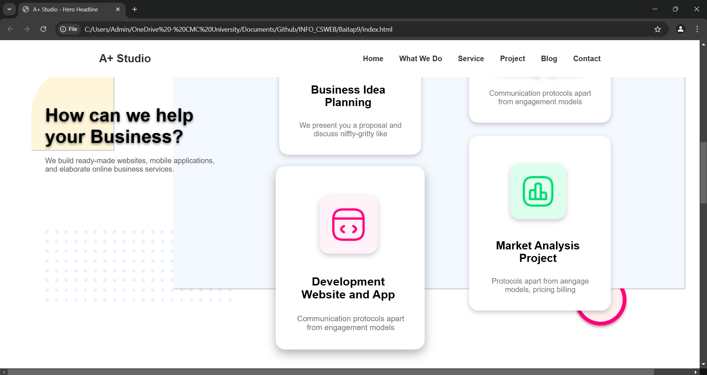
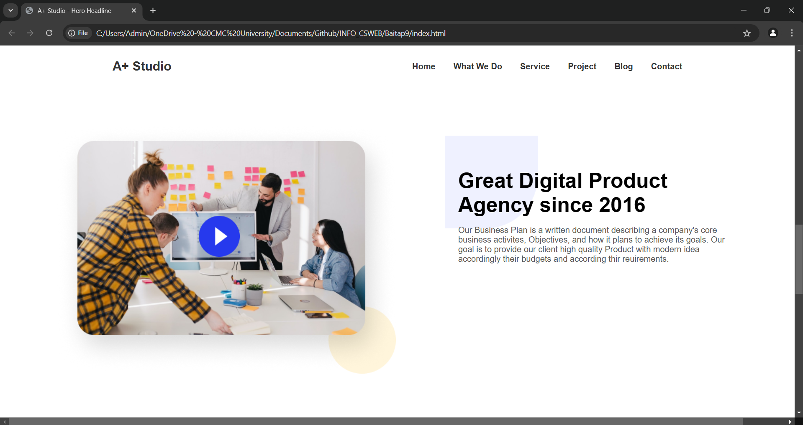
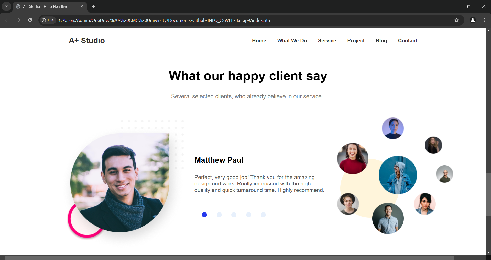

</head>
<body>
    

        <h2>Thông tin sinh viên</h2>
        
<strong>Tên sinh viên:</strong> Nguyễn Lê Dương

        
<strong>Mã sinh viên:</strong> BIT230124

        
<strong>Tên bài tập:</strong> Bài 10: Cắt giao diện theo thiết kế figma

        
<strong>Ảnh kết quả bài tập:</strong>

    

</body>
</html>

